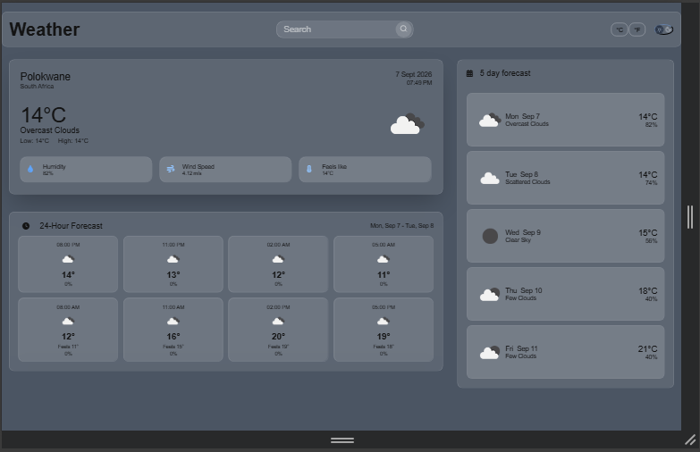

<h1 align="center">Task 3 WeatherApp</h1>

<p>Real-time weather dashboard, location auto-detection system, Hourly & daily forecasts, Multiple country and city search, theme customizations options and offline data catching</p>

<p>Features</p>

- *Real-time Weather Data:* current weather conditions with detailed metrics
- *Smart Location Detection:* Automatic geolocation with IP fallback 
- *Comprehensive forecasts:*
     - Hourly forecast for the next 24hours
     - Daily forecast for 7 days
- *Global search:* search weather for any city worldwide
- *Theme customization:* light/Dark mode with smooth transitions
- *Offline support:* Cache weather data for offline viewing
- *Responsive design:* works seamlessly on desktop, tablet and mobile

## Screenshot 
<p align="center">
  
</p>

<p>Resources</p>

Custom-night-mode-toggle
-[Custom Night Mode Toggle](https://dev.to/ninjasoards/make-a-custom-night-mode-toggle-w-react-css-variables-272o) 

css variables 
- [CSS Variables Guide](https://www.youtube.com/watch?v=W5_5WvYjPeI)
- [CSS Variables Tutorial](https://www.youtube.com/watch?v=5wLrz_zUwoU)

Error-Handling 
- [Error Handling in Web Apps](https://dev.to/doylecodes/making-alerts-for-a-web-app-41d6)

APIs
-  [Building a Weather App in React: A Beginner's Guide](https://medium.com/@frontendqueens/building-a-weather-app-in-react-a-beginners-guide-054c43251d40)

Geolocation API
- [React Geolocation API Hook](https://velog.io/@hazae23/React-geolocation-API-hook) (Translate to English)
-  [IP Geolocation Fallback API](https://www.bigdatacloud.com/blog/new-feature-update-free-client-side-reverse-geocoding-api-with-ip-geolocation-fallback)

<h4>Prerequisites</h4>

- Node.js (v14 or higher)

<hr>

<h3>Getting started</h3>

### Steps to Run Locally

```bash
# Clone the repository
git clone https://github.com/NeeloByron/Task_3_weatherApp.git
```

```bash
# Navigate to the project directory
cd weatherapp
```

```bash
# Install dependencies
npm install
```

```bash
# Start development server
npm run dev
```

Technologies Used

- React - Frontend framework
- CSS Variables - Theme customization
- Geolocation API - Location detection
- Weather API - Real-time weather data

License

- This project is open and available under the MIT License.

Acknowledgements 

- *Weather data provided by:* Open WeatherAPi


